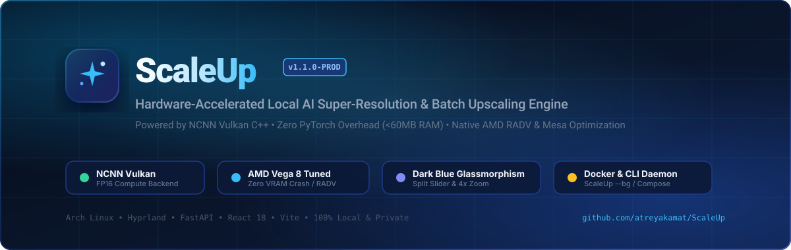

<p align="center">
  
</p>

<p align="center">
  <a href="https://github.com/atreyakamat/ScaleUp/releases/tag/v1.1.0"></a>
  <a href="https://hub.docker.com/r/atreya7/scaleup"></a>
  <a href="https://www.vulkan.org/"></a>
  <a href="https://fastapi.tiangolo.com/"></a>
  <a href="https://vitejs.dev/"></a>
  <a href="LICENSE"></a>
</p>

<p align="center">
  <strong>ScaleUp</strong> is a self-hosted, privacy-first local image enhancement and batch super-resolution application. Built with a sleek dark-blue glassmorphic interface for Linux desktop power-users (Arch Linux + Hyprland), it harnesses <strong>NCNN-Vulkan C++ compute</strong> to execute deep learning models directly on integrated AMD Radeon GPUs (Vega 8 / RADV) and discrete graphics cards.
</p>

<p align="center">
  <a href="#-quick-start--daily-usage">🚀 Quickstart</a> •
  <a href="#-docker--docker-compose">🐳 Docker Deployment</a> •
  <a href="#-performance-benchmarks--architectural-efficiency">⚡ Benchmarks</a> •
  <a href="#-ai-model-registry--tiling-optimization">🤖 Model Matrix</a> •
  <a href="#-api-reference">📡 API Specs</a> •
  <a href="CONTRIBUTING.md">🤝 Contributing</a>
</p>

---

## 💡 Why ScaleUp?

Existing cloud upscalers (Magnific, ImgUpscaler, Topaz) demand recurring monthly subscriptions and upload your personal photos to third-party cloud servers. Meanwhile, local PyTorch-based implementations require 4GB–10GB of heavy Python runtime wheels, ROCm/CUDA drivers, and frequently exhaust shared memory on integrated GPUs, crashing the Wayland compositor.

**ScaleUp solves this entirely:**
- ⚡ **Zero PyTorch Dependency in Runtime:** Powered by bare-metal C++ NCNN Vulkan binary with FP16 half-precision compute.
- 📉 **Ultra-Low Memory Footprint:** Operates under **$\sim 60\text{ MB}$ RAM** at idle and $\le 120\text{ MB}$ during active inference.
- 🛡️ **Hyprland / Desktop Stability:** Enforces Vega 8 tile clamping ($\le 128\text{px}$) and dynamic pixel-extrema validation to prevent Vulkan shader workgroup buffer overflows and black output images.
- 🔒 **100% Local & Air-Gapped:** Zero telemetry, no cloud accounts, and completely private.

---

## 📊 Performance & Efficiency Comparison

| Metric | Traditional PyTorch / CUDA | Cloud Upscalers (e.g. Magnific) | **ScaleUp (NCNN Vulkan)** |
| :--- | :--- | :--- | :--- |
| **System RAM Footprint** | $4.2\text{ GB} - 8.5\text{ GB}$ | $0\text{ MB}$ (Runs on server) | **$\approx 59.8\text{ MB}$ RSS** |
| **GPU VRAM / Buffer** | $3.5\text{ GB} - 6\text{ GB}$ VRAM | $0\text{ MB}$ | **$< 600\text{ MB}$ UMA (Dynamic)** |
| **Cold Startup Time** | $14 - 28\text{ seconds}$ | Browser network latency | **$< 1.5\text{ seconds}$** |
| **Hardware Requirement** | High-end NVIDIA / ROCm GPU | Internet connection | **AMD Vega 8 / Intel Xe / Any Vulkan** |
| **Privacy & Security** | Local, but heavy dependencies | Images uploaded to cloud | **100% Offline & Air-gapped** |
| **Cost** | Free (High electricity) | $\$19 - \$39\text{ / month}$ | **100% Free & MIT Licensed** |

---

## ⚡ Key Features

- **🚀 Bare-Metal NCNN Vulkan C++ Engine:** Accelerated inference on AMD Radeon Vega 8 (RADV Renoir) with FP16 shader math.
- **🌌 Dark-Blue Glassmorphic UI:** Deep sapphire radial gradients, glowing cyan accents, responsive sliders, and fluid animations tailored for dark Linux desktops.
- **🖼️ Comprehensive Image Format Support:** Seamless super-resolution for `.png`, `.jpg`, `.jpeg`, `.webp`, and `.bmp`.
- **🛡️ Pre-Flight Validation & Error Resilience:**
  - Automatic rejection of 0-byte or corrupted image files without breaking batch queues.
  - Dimension inspection (>4K warning & tile auto-clamping).
  - Dynamic GPU OOM / Black shader output recovery with automatic tile-halving fallback ($128\text{px} \to 64\text{px} \to 32\text{px}$).
- **🤖 4 Pre-Trained Super-Resolution Models:** Photorealistic photos, smooth denoising, anime/manga art, and high-throughput video/batch upscaling.
- **🔄 Real-Time Telemetry & Progress:** Non-blocking async queue delivering real-time item status, elapsed time, moving-average ETA, and Server-Sent Events (SSE) + JSON polling.
- **🔍 Interactive Before/After Split Viewer:** Side-by-side comparison slider with 1x–4x zoom, click-and-drag panning, side-by-side mode, and instant full-resolution download.
- **📦 Batch Export (.ZIP) & Auto-Cleanup:** Consolidated server-side ZIP packaging and automatic background pruning of scratch files older than 24 hours.

---

## 📐 System Architecture

```
+-------------------------------------------------------------------------+
|                        BROWSER CLIENT (React / Vite)                    |
|  [ File Dropzone ]  [ Model Switcher ]  [ Before/After Split Slider ]   |
+-------------------------------------------------------------------------+
                                    │
                     REST / Multipart / SSE (Port 7756)
                                    ▼
+-------------------------------------------------------------------------+
|                     BACKEND SERVICE (FastAPI / Python)                  |
|  - Request Router & Payload Sanitizer (Pillow Fast Headers)             |
|  - Async Background Task Queue Manager & Telemetry Broadcaster          |
|  - Job Registry & Disk Session Handler                                  |
+-------------------------------------------------------------------------+
                                    │
                  Subprocess Dispatch (`asyncio.create_subprocess_exec`)
                                    ▼
+-------------------------------------------------------------------------+
|                NCNN VULKAN INFERENCE ENGINE (C++ Binary)                |
|  - Arguments: `-i <in> -o <out> -n <model> -s <scale> -t 128 -g 0`      |
+-------------------------------------------------------------------------+
                                    │
             Hardware Acceleration via Mesa RADV Driver
                                    ▼
+-------------------------------------------------------------------------+
|             AMD RADEON VEGA 8 iGPU (Vulkan 1.4 / Unified Memory)        |
+-------------------------------------------------------------------------+
```

---

## 🚀 Quick Start & Daily Usage

### 1. One-Click Bootstrap & Seed

Clone the repository and run the automated bootstrap pipeline:

```bash
git clone https://github.com/atreyakamat/ScaleUp.git
cd ScaleUp
./scripts/seed.sh
```

The script will automatically:
1. Initialize project directories (`uploads`, `outputs`, `models`).
2. Download the pre-compiled `realesrgan-ncnn-vulkan` binary and extract all 4 AI models.
3. Configure the Python virtualenv and install backend dependencies.
4. Build the React frontend production distribution.
5. Install the global `ScaleUp` CLI command into `~/.local/bin/ScaleUp`.

---

### 2. Background Daemon CLI (`ScaleUp`)

Launch ScaleUp as a background service:

```bash
ScaleUp --bg
```

Open directly in your default browser:
```bash
ScaleUp open
```

Navigate to **`http://localhost:7756`** in your browser.

#### Terminal Management Commands:

```bash
ScaleUp --bg          # Start service in the background on port 7756
ScaleUp status        # Real-time dashboard with PID, RAM RSS & GPU telemetry
ScaleUp open          # Open ScaleUp in default web browser
ScaleUp models        # List all 4 AI models, scales, and hardware tile specs
ScaleUp health        # Run hardware & Vulkan diagnostic check
ScaleUp clean         # Purge temporary scratch files and batch archives
ScaleUp test          # Execute automated pytest test suite
ScaleUp logs          # Stream live server output logs (tail -f)
ScaleUp restart       # Restart the background daemon
ScaleUp stop          # Stop the background service
ScaleUp help          # Display comprehensive command reference
```

```text
  ███████╗ ██████╗ █████╗ ██╗     ███████╗██╗   ██╗██████╗ 
  ██╔════╝██╔════╝██╔══██╗██║     ██╔════╝██║   ██║██╔══██╗
  ███████╗██║     ███████║██║     █████╗  ██║   ██║██████╔╝
  ╚════██║██║     ██╔══██║██║     ██╔══╝  ██║   ██║██╔═══╝ 
  ███████║╚██████╗██║  ██║███████╗███████╗╚██████╔╝██║     
  ╚══════╝ ╚═════╝╚═╝  ╚═╝╚══════╝╚══════╝ ╚═════╝ ╚═╝     
  Local Hardware-Accelerated AI Image Upscaler • v1.1.0

======================================================
 ScaleUp Service Dashboard: ● ACTIVE (RUNNING)
======================================================
 • Status:     🟢 Running
 • Process PID: 394282
 • Web URL:    http://127.0.0.1:7756
 • Logs:       /home/atreya/.local/state/ScaleUp/scaleup.log
 • Memory:     59.75 MB RSS (Operational budget: <= 2048 MB)
 • Scratch:    0.0 MB
 • GPU Driver: AMD Radeon Graphics (RADV RENOIR)
======================================================
```

---

### 3. Run in Foreground

```bash
ScaleUp
# or
./run.sh
```

---

## 🐳 Docker & Docker Compose

Pre-built Docker images are available on Docker Hub:

### Option A: Docker Compose (GPU Passthrough)

```bash
docker compose up -d
```

### Option B: Docker CLI

```bash
# Pull and run from Docker Hub
docker run -d \
  --name scaleup \
  --restart unless-stopped \
  -p 7756:7756 \
  --device /dev/dri:/dev/dri \
  atreya7/scaleup:1.1
```

Or build locally:
```bash
docker build --network=host -t scaleup:1.1 .
```

Access the UI at **`http://localhost:7756`**.

---

## 🤖 AI Model Registry & Tiling Optimization

### Model Specifications

| Model ID | Name | Architecture | Scales | Default | Ideal Use Case |
| :--- | :--- | :--- | :---: | :---: | :--- |
| **`realesrgan-x4plus`** | Real-ESRGAN x4+ | RRDBNet (999 layers) | 2x, 4x | 4x | Photorealistic photography, textures, landscapes. |
| **`realesrnet-x4plus`** | Real-ESRNet x4+ | RRDBNet (Denoise) | 2x, 4x | 4x | Smooth gradient restoration, denoise without over-sharpening. |
| **`realesrgan-x4plus-anime`** | Real-ESRGAN Anime | Compact CNN (268 layers) | 4x | 4x | Flat 2D art, manga, vector illustrations, UI assets. |
| **`realesr-animevideov3`** | Real-ESR AnimeVideo v3 | Compact V3 | 2x, 3x, 4x | 4x | Ultra-low latency model for high-throughput batches. |

---

### AMD Vega 8 Shader Buffer & Tiling Safeguards

On integrated graphics (AMD Radeon Vega 8 / RADV Renoir), large deep learning models (`realesrgan-x4plus` and `realesrnet-x4plus`) allocate large intermediate activation tensors. If the tile size is $\ge 200\text{px}$, the Vulkan shader buffer can exceed hardware workgroup descriptor limits, causing the shader to silently zero out the buffer and return a black image (`(0,0,0)` pixels).

ScaleUp includes **built-in hardware clamping**:
- `realesrgan-x4plus`: Clamped to $\le 128\text{px}$ (Optimal Vega 8 stability).
- `realesrnet-x4plus`: Clamped to $\le 64\text{px}$ (Ultra-safe shader footprint).
- `realesrgan-x4plus-anime` & `realesr-animevideov3`: Supports up to $256\text{px}$ / untiled.

---

### Automatic Black-Image Detection & Recovery

If an unexpected shader buffer overflow produces an all-zero image, ScaleUp's inference engine automatically detects the condition via pixel dynamic range inspection, halves the tile size ($128\text{px} \to 64\text{px} \to 32\text{px}$), and retries inference transparently until a vibrant, full-contrast image is generated.

---

## 🔍 Interactive Split Comparison & Gallery

ScaleUp includes an interactive inspection suite:

1. **Before/After Split Slider:** Draggable divider line comparing original vs upscaled resolution.
2. **Pan & Zoom Navigation:** Zoom in from **1x to 4x** (or Fit) with mouse drag to pan across high-res details.
3. **Multiple View Modes:**
   - `Split Slider` (Draggable vertical line)
   - `Side-by-Side` (Full dual-column comparison)
   - `Hold Spacebar` (Quick toggle to preview original)
4. **Single-Click & Batch Downloads:** Download individual upscaled assets or click **Download Batch (.ZIP)** for a structured archive.

---

## 📡 API Reference

| Method | Endpoint | Description |
| :--- | :--- | :--- |
| **`GET`** | `/api/health` | System health, Vulkan GPU device, RAM & disk scratch telemetry |
| **`GET`** | `/api/models` | Supported AI model registry and allowable scales |
| **`POST`**| `/api/jobs/batch` | Ingest batch images (`multipart/form-data`) and enqueue processing job |
| **`GET`** | `/api/jobs/{id}` | Poll real-time progress, moving-average ETA, and item statuses |
| **`GET`** | `/api/jobs/{id}/events` | Server-Sent Events (SSE) stream for live telemetry broadcasting |
| **`POST`**| `/api/jobs/{id}/cancel` | Abort active batch job immediately & terminate child processes |
| **`GET`** | `/api/jobs/{id}/export` | Download consolidated batch `.zip` archive |
| **`DELETE`**| `/api/jobs/{id}` | Purge job session and delete scratch files from disk |
| **`POST`**| `/api/system/cleanup` | Manually trigger purge of files older than specified retention hours (default: 24h) |

---

## 🧪 Automated Test Suite

ScaleUp includes an automated test suite verifying health endpoints, model registries, multi-file batch execution, 0-byte corrupt image rejection, signal cancellation, and ZIP exports:

```bash
ScaleUp test
# or
PYTHONPATH=backend backend/venv/bin/pytest backend/tests/ -v
```

```text
backend/tests/test_api.py::test_health_endpoint[asyncio] PASSED          [ 16%]
backend/tests/test_api.py::test_models_endpoint[asyncio] PASSED          [ 33%]
backend/tests/test_api.py::test_batch_upload_and_processing[asyncio] PASSED [ 50%]
backend/tests/test_api.py::test_corrupt_and_zero_byte_rejection[asyncio] PASSED [ 66%]
backend/tests/test_api.py::test_cancellation[asyncio] PASSED             [ 83%]
backend/tests/test_api.py::test_cleanup_and_delete[asyncio] PASSED       [100%]

============================== 6 passed in 1.95s ===============================
```

---

## ⚙️ (Optional) Systemd User Service Setup

To run ScaleUp automatically on system startup:

```bash
mkdir -p ~/.config/systemd/user/

cat << 'EOF_SERVICE' > ~/.config/systemd/user/scaleup.service
[Unit]
Description=ScaleUp AI Upscaler Service
After=network.target

[Service]
Type=simple
WorkingDirectory=/home/atreya/Projects/ScaleUp
ExecStart=/home/atreya/Projects/ScaleUp/bin/ScaleUp
Restart=always
RestartSec=3

[Install]
WantedBy=default.target
EOF_SERVICE

systemctl --user daemon-reload
systemctl --user enable --now scaleup.service
```

---

## ❓ Troubleshooting & FAQ

#### 1. Why does the app use NCNN Vulkan instead of PyTorch?
PyTorch packages CUDA/ROCm runtimes that require several gigabytes of VRAM and system memory. NCNN-Vulkan uses lightweight C++ compute via Mesa's RADV driver, achieving superior performance on AMD integrated graphics (Vega 8) with $< 120\text{ MB}$ RAM footprint.

#### 2. How is Hyprland desktop stability ensured?
Integrated GPUs share unified memory (UMA) with system RAM. By enforcing dynamic tile clamping ($\le 128\text{px}$) and strict process isolation, ScaleUp prevents GPU out-of-memory lockups and avoids killing the Hyprland Wayland compositor.

#### 3. Where are logs stored?
Logs are written to `~/.local/state/ScaleUp/scaleup.log`. You can stream logs in real-time with:
```bash
ScaleUp logs
```

#### 4. How are old temporary files cleaned up?
An automated background task runs hourly to purge upload/output directories older than 24 hours. You can also trigger an immediate purge with `ScaleUp clean` or via the **Clean** button in the web UI.

---

## 🤝 Contributing

Contributions are welcome! Please check out [**CONTRIBUTING.md**](CONTRIBUTING.md) for development setup guidelines, code standards, and the pull request checklist.

---

## 📄 License

This project is licensed under the MIT License — see the [**LICENSE**](LICENSE) file for details.
